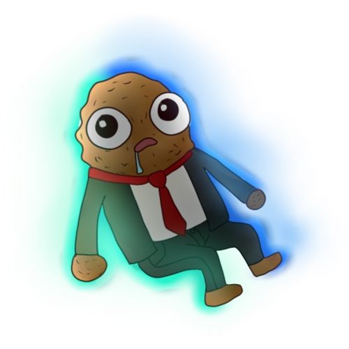

<pre>

██████╗  ██████╗  ██████╗██╗  ██╗███████╗████████╗    ███╗   ██╗██╗   ██╗ ██████╗  ██████╗ ███████╗████████╗
██╔══██╗██╔═══██╗██╔════╝██║ ██╔╝██╔════╝╚══██╔══╝    ████╗  ██║██║   ██║██╔════╝ ██╔════╝ ██╔════╝╚══██╔══╝
██████╔╝██║   ██║██║     █████╔╝ █████╗     ██║       ██╔██╗ ██║██║   ██║██║  ███╗██║  ███╗█████╗     ██║   
██╔═══╝ ██║   ██║██║     ██╔═██╗ ██╔══╝     ██║       ██║╚██╗██║██║   ██║██║   ██║██║   ██║██╔══╝     ██║   
██║     ╚██████╔╝╚██████╗██║  ██╗███████╗   ██║       ██║ ╚████║╚██████╔╝╚██████╔╝╚██████╔╝███████╗   ██║   
╚═╝      ╚═════╝  ╚═════╝╚═╝  ╚═╝╚══════╝   ╚═╝       ╚═╝  ╚═══╝ ╚═════╝  ╚═════╝  ╚═════╝ ╚══════╝   ╚═╝   
</pre>

---

  
  
  

### `> whoami`

<h1 align="left">Goben Diego Constantino Aguirre</h1>
<h3 align="left">a.k.a. PocketNugget</h3>

### `> cat /etc/profile`

**📖 Professional Summary**

* I'm a Computer Systems Engineering student at UDLAP with a passion for cybersecurity and software development. 
* As President of the Hackztecs cybersecurity organization, I lead teams in Capture the Flag (CTF) competitions and security research. 
* My expertise spans across cybersecurity, AI, software engineering, and infrastructure development.

**🏆 Specialties**
* 🛡️ Cybersecurity Specialist
* 🚩 CTF Team Leader
* 💻 Software Engineer
* 🤖 AI Researcher

### `> ls -a /home/goben`

**👨‍💻 About Me**
* 👨 He/Him
* 🇲🇽 Mexican
* 🚀 DevOps & UX/UI Enthusiast
* 🗣️ Languages: English (C1+), Spanish (Native), French (A2)

**🌱 Currently Learning**
* 🔐 Sharpening my skills for the next CTF challenge
* 🤖 Exploring advanced AI & ML concepts
* 🐳 Mastering Docker, Kubernetes, and the world of DevOps
* 🎤 Sharing knowledge through workshops and public speaking

### `> ls -l /skills`

**Languages:**

**Tools & Technologies:**

### `> history | grep "work"`

* **Junior SOC Analyst @ TBSeK** (Apr 2025 - Present)
    * Monitor and analyze security events using SIEM tools to detect and respond to potential threats.
    * Conduct initial triage of security incidents, escalating as necessary.
* **Software Engineer Intern @ T-Systems** (Apr 2024 - Jul 2024)
    * Created a course tracking platform with Node.js and MySQL, improving learning outcomes by 40%.
* **Infrastructure Engineer @ iOS Lab Development Team** (Aug 2024 - Present)
    * Developed and deployed servers for campus-hosted projects using Docker on Raspberry Pi.

### `> cat /etc/group`

* **President @ Hackztecs Cybersecurity Organization** (Jan 2024 - Present)
* **Treasurer @ ACM Student Chapter, UDLAP** (Aug 2024 - Present)
* **Treasurer @ Computer Systems Engineering Interim Board** (Aug 2024 - Present)

### `> tail -n 4 projects.log`
* **[Published Research: Easy for Us, Complex for AI](https://link.springer.com/chapter/10.1007/978-3-031-47990-1_38)**: Authored a paper on assessing the coherence of AI-generated images.
* **WayZT iOS App**: Won 1st Place at a local hackathon for an app that uses ML for waste detection.
* **Home Server**: Developed and manage a home server on a Raspberry Pi using Docker.
* **Hack the Box CTF**: Led my team to the top 3.5% in the Hack The Box Cyber Apocalypse CTF.

### `> netstat -tulpn`
  

  

